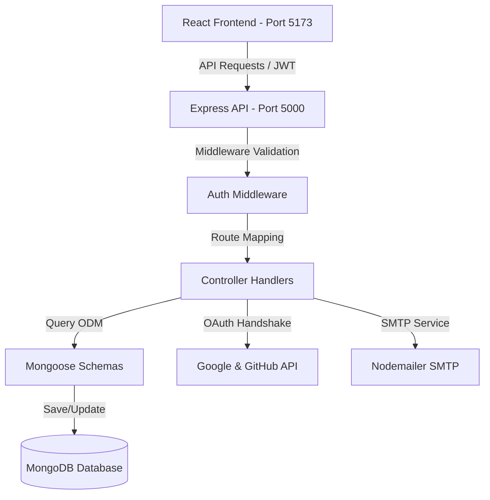
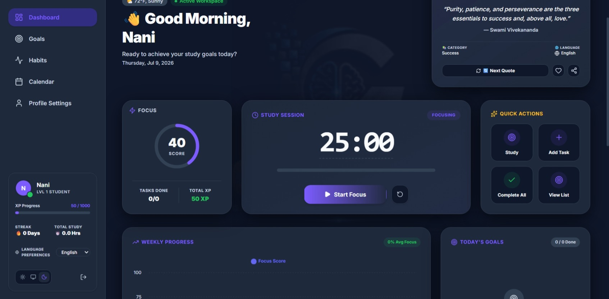
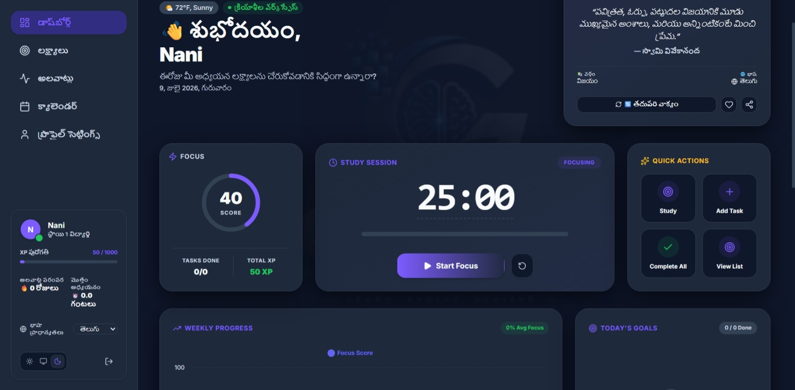
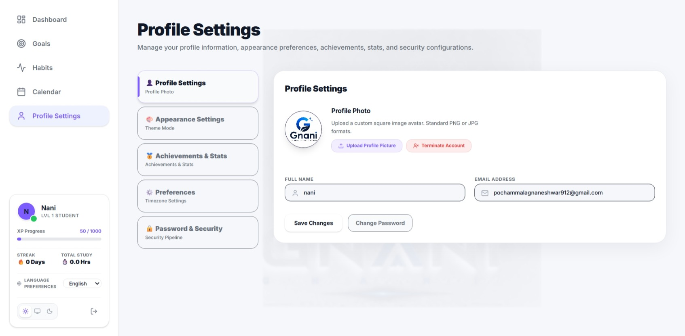
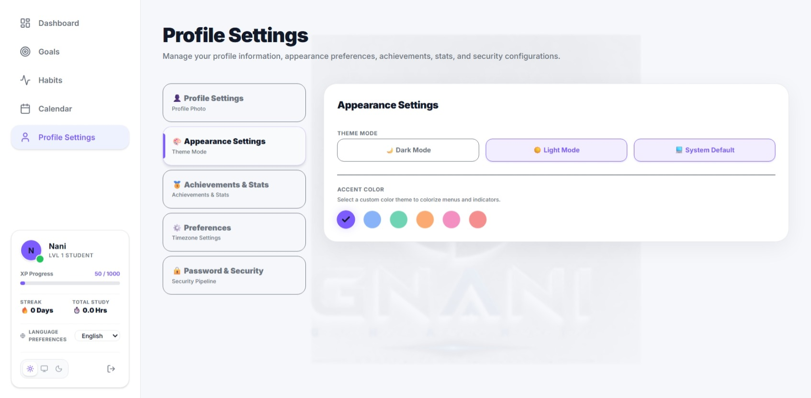
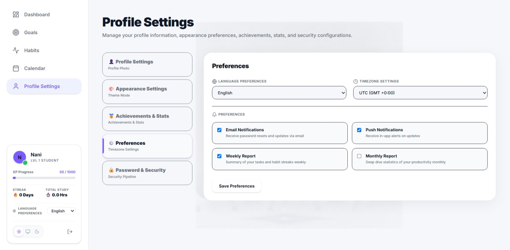
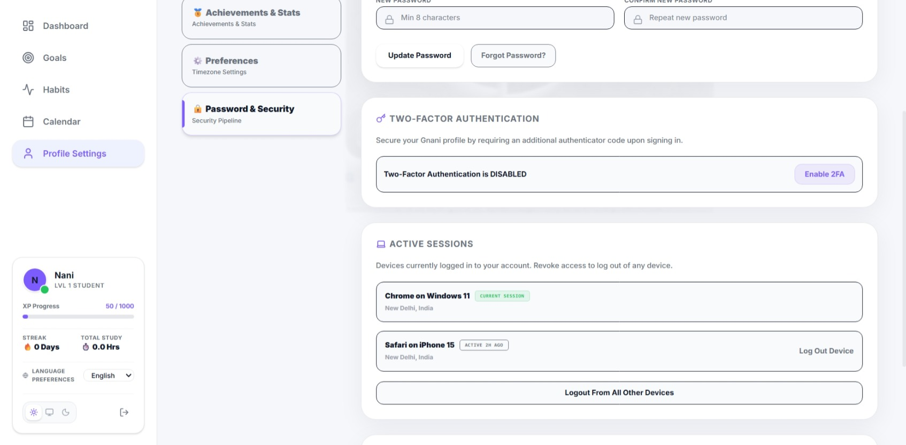
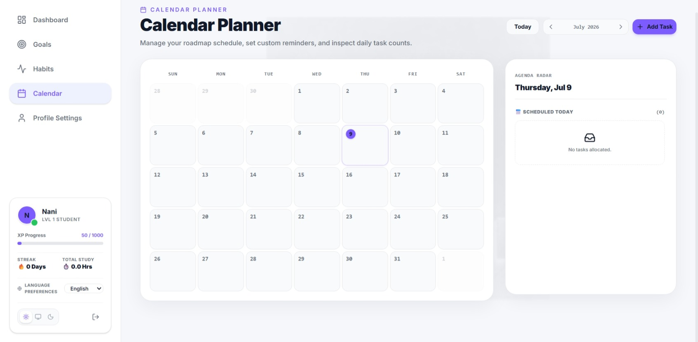
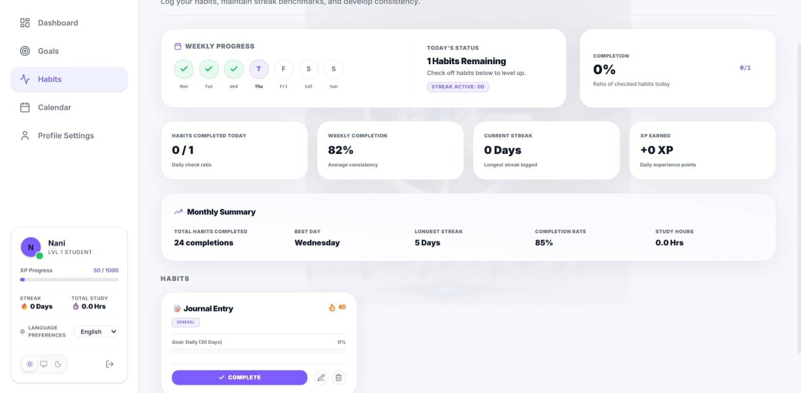
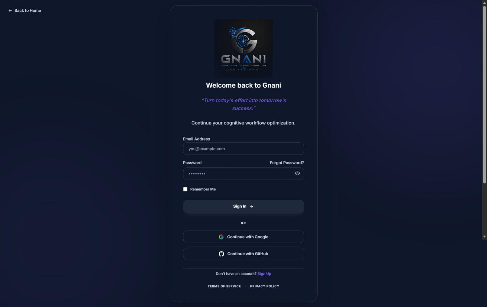

<div align="center">

# 🧠 GNANI
### **Gain • New • Abilities • Never • Idle**


### 🚀 Premium Personal Productivity & Study Workspace

**Learn • Evolve • Achieve**

[](https://react.dev/)
[](https://www.typescriptlang.org/)
[](https://vite.dev/)
[](https://nodejs.org/)
[](https://expressjs.com/)
[](https://www.mongodb.com/)
[](https://opensource.org/licenses/MIT)

</div>

---

## 📌 Project Overview

**GNANI** is a premium, open-source productivity environment tailored for students and modern learners. It brings together habit tracking, task boards, calendars, Pomodoro study focus sessions, and statistics visualization under a single, highly refined interface. Equipped with state-of-the-art authentication flows (OAuth, verified signup, token security) and a robust localized vocabulary engine, GNANI empowers you to establish routines, maintain streak consistency, and level up your skills.
Live:https://gnani-study-hub.vercel.app/

---

## ⚡ Core Features

### 🔐 Authentication & Identity
*   **Email Sign-Up & Verification:** Registration flow requiring secure email OTP verification to prevent dummy accounts.
*   **OAuth Integrations:** Fully configured Google OAuth and GitHub OAuth single-sign-on (SSO) systems.
*   **Security Protocols:** High-entropy JWT session tokens, bcrypt password hashing, forgot-password email loops, and strict CORS rules.

### 📊 Dashboard & Metrics
*   **Time-Adaptive Greetings:** Custom greeting banners reflecting the current time of day.
*   **Productivity Metrics:** Real-time metrics visualization cards tracking **Focus Score**, **XP Earned**, **Tasks Completed**, **Streaks**, and **Total Study Time**.
*   **Analytical Visualizations:** Dynamic Area Charts plotting weekly study, focus, and experience point progress using Recharts.
*   **Motivational Quotes:** Hand-crafted quote panel supporting categorization, rating, saving to favorites, and text sharing.

### 🎯 Habits & Routine Builder
*   **Streak-Tracking Engine:** Automatic streak calculation rewards daily consistency with experience points (XP).
*   **Flexible Recurrence:** Define habits that recur daily, weekly, or on specific days of the week.
*   **Visual History:** Clean calendar matrices illustrating complete completion histories.

### 📋 Objectives Board (Kanban)
*   **Task Status Columns:** Move tasks across *To Do*, *In Progress*, *In Review*, and *Completed*.
*   **Priority Hierarchy:** Segment focus by *High*, *Medium*, and *Low* priority settings.
*   **Due Dates & Categories:** Set hard targets with built-in due-date countdowns.

### ⏱ Pomodoro Timer
*   **Focus Intervals:** Configure study blocks, short breaks, and long breaks.
*   **Browser-Tab Synchronization:** Tab titles display countdown ticks dynamically so you can track time while browsing.

### 🌍 Localization & Theme Engine
*   **Four Languages:** Support for **English**, **Telugu**, **Hindi**, and **French** using an inline dictionary system.
*   **Accent & Mode Adjustments:** Fluid transitions between **Light**, **Dark**, and **System Default** themes.

---

## 🛠 Tech Stack

| Component | Technology | Version | Key Libraries / Utilities |
| :--- | :--- | :--- | :--- |
| **Frontend** | React | `^19.2.7` | Vite, React Router, Recharts, Framer Motion, Axios |
| **Styling** | Tailwind CSS | `^4.3.2` | Tailwind-merge, PostCSS, Autoprefixer |
| **Backend** | Node.js / Express | `^5.2.1` | ts-node-dev, cors, helmet, express-rate-limit |
| **Database** | MongoDB | `^9.7.3` | Mongoose ODM, MongoDB Compass |
| **Mailing** | Nodemailer | `^9.0.3` | Custom verification SMTP transport templates |
| **Security** | JSON Web Tokens | `^9.0.3` | bcryptjs, secure CORS headers, environment overrides |

---

## 📐 System Architecture

The database schema and service layers interact through the following topology:



---

## 📂 Folder Structure

```
GNANI/
├── backend/
│   ├── src/
│   │   ├── config/             # MongoDB database connection configuration
│   │   ├── controllers/        # Express handlers (auth, habits, objectives, profile)
│   │   ├── middleware/         # Auth verification and logging middleware
│   │   ├── models/             # Mongoose schemas (User, Habit, Objective)
│   │   ├── routes/             # Core endpoints (auth, habits, objectives, profiles)
│   │   └── server.ts           # REST API server mount point
│   ├── package.json
│   └── tsconfig.json
├── frontend/
│   ├── public/                 # Branding assets, favicons, PWA icons, manifest files
│   ├── src/
│   │   ├── assets/             # Static graphics
│   │   ├── components/         # Interactive UI components
│   │   │   ├── common/         # Premium branding components (watermarks, logos)
│   │   │   └── ...
│   │   ├── context/            # Global contexts (Auth, Theme, I18n translations)
│   │   ├── data/               # Local static dictionary and mock datasets
│   │   ├── lib/                # API client connection configurations
│   │   ├── pages/              # Password recovery flow layout
│   │   ├── App.tsx             # Primary app layout controller
│   │   ├── main.tsx            # DOM node mounting loader
│   │   └── index.css           # Global Tailwind stylesheet
│   ├── package.json
│   └── vite.config.ts
└── README.md
```
# 📸 Application Screenshots

---

## 🌙 Dashboard (Dark Mode)

The dark-themed dashboard provides an immersive study environment with AI-powered insights, focus timer, quick actions, productivity statistics, motivational quotes, and weekly progress tracking.

<p align="center">
  
</p>

---

## ☀️ Dashboard (Light Mode)

The light-themed dashboard offers the same productivity features with a clean and modern interface, making it comfortable for daytime usage.

<p align="center">
  
</p>

---

## 👤 Profile Settings

Manage your personal profile by updating your profile picture, name, and account information. Users can easily customize their identity and manage account preferences.

<p align="center">
  
</p>

---

## 🎨 Appearance Settings

Personalize the application with Light Mode, Dark Mode, or System Theme. Users can also choose custom accent colors to match their preferred interface style.

<p align="center">
  
</p>

---

## ⚙️ User Preferences

Configure language preferences, timezone, email notifications, push notifications, and weekly/monthly productivity reports to personalize the overall experience.

<p align="center">
  
</p>

---

## 🔒 Password & Security

Enhance account security with password management, Two-Factor Authentication (2FA), active session monitoring, and secure device management.

<p align="center">
  
</p>

---

## 📅 Calendar Planner

Organize daily, weekly, and monthly study schedules with an interactive calendar. Users can add tasks, manage deadlines, and keep track of upcoming activities.

<p align="center">
  
</p>

---

## 📈 Habit Tracker

Track study habits, monitor streaks, analyze weekly performance, earn XP, and maintain consistency through an intuitive habit management system.

<p align="center">
  
</p>

---

## 🔑 Authentication System

A secure authentication page supporting Email & Password login, Google OAuth, GitHub OAuth, Remember Me functionality, and password recovery.

<p align="center">
  
</p>

---

## 🚀 Getting Started

### 📋 Prerequisites
Ensure you have the following installed locally:
*   [Node.js](https://nodejs.org/) (v18.x or above)
*   [MongoDB](https://www.mongodb.com/) (running instance or Atlas connection URI)
*   [Git](https://git-scm.com/)

---

### 🔧 Installation Steps

1.  **Clone the repository:**
    ```bash
    git clone https://github.com/gnaneshwar8143/Gnani-StudyHub.git
    cd Gnani-StudyHub
    ```

2.  **Configure Environment Variables:**
    Create a `.env` file in the `backend/` directory based on the template below:
    ```env
    MONGODB_URI=mongodb+srv://<username>:<password>@cluster0.example.mongodb.net/lifeos
    

    SMTP_HOST=smtp.gmail.com
    SMTP_PORT=587
    SMTP_USER=your_email_here
    SMTP_PASS=your_app_password_here
    SMTP_FROM=your_email_here
    CLIENT_URL=https://gnani-study-hub.vercel.app
    GOOGLE_CLIENT_ID=your_google_client_id_here
    GOOGLE_CLIENT_SECRET=your_google_client_secret_here
    GOOGLE_CALLBACK_URL=http://localhost:5000/api/auth/google/callback
    GITHUB_CLIENT_ID=your_github_client_id_here
    GITHUB_CLIENT_SECRET=your_github_client_secret_here
    GITHUB_CALLBACK_URL=http://localhost:5000/api/auth/github/callback
    ```

3.  **Launch the Backend Server:**
    ```bash
    cd backend
    npm install
    npm run dev
    ```
    The server will connect to MongoDB and start on `http://localhost:5000`.

4.  **Launch the Frontend App:**
    ```bash
    cd ../frontend
    npm install
    npm run dev
    ```
    Open your browser to `http://localhost:5173`.

---

## ⚡ API Overview

All routes are prefixed with `/api`. Protected routes require a valid JWT token in the `Authorization: Bearer <Token>` header.

| Endpoint | Method | Authentication | Description |
| :--- | :--- | :--- | :--- |
| `/auth/signup` | POST | Public | Registers a new user and triggers verification mail |
| `/auth/login` | POST | Public | Validates credentials and returns JWT token |
| `/auth/verify-email` | POST | Public | Confirms register token to activate user account |
| `/auth/google` | GET | Public | Redirects user to Google OAuth platform |
| `/auth/github` | GET | Public | Redirects user to GitHub OAuth platform |
| `/habits` | GET | Protected | Retrieves active habits checklist |
| `/habits/:id/toggle` | PUT | Protected | Marks a habit complete for today, updating streaks |
| `/objectives` | GET | Protected | Fetches Kanban study board items |
| `/user/stats` | GET | Protected | Fetches user experience level, hours, and xp metrics |

---

## 🔒 Security & Performance Features

*   **Secure Hashing:** bcryptjs comparison for password verification on backend server layers.
*   **Security Headers:** Helmet integration inside Express maps out standard security headers to prevent sniffing.
*   **CORS Protection:** Requests are bounded exclusively to allowed Origins (`localhost:5173` and production hooks).
*   **Session Isolation:** Stateless token management blocks session hijack attempts on frontend layers.

---

## 🤝 Contributing

Contributions are welcome! Please follow these guidelines:
1. Fork the Project.
2. Create a Feature Branch (`git checkout -b feature/NewFeature`).
3. Commit your changes (`git commit -m 'Add some NewFeature'`).
4. Push to the Branch (`git push origin feature/NewFeature`).
5. Open a Pull Request.

---

## 📄 License

Distributed under the MIT License. See [LICENSE](LICENSE) for more details.

---

## 👨‍💻 Author

**Gnaneshwar Pochammala**
*   GitHub: [@gnaneshwar8143](https://github.com/gnaneshwar8143)
*   Vision: *Creating high-performance productivity frameworks for modern learners.*
